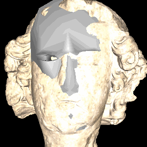
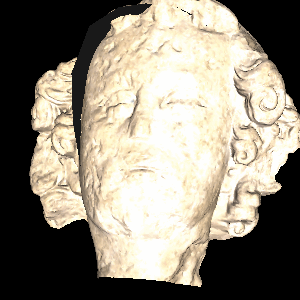
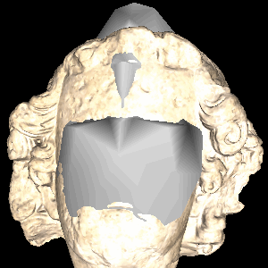
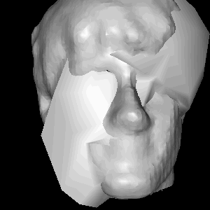
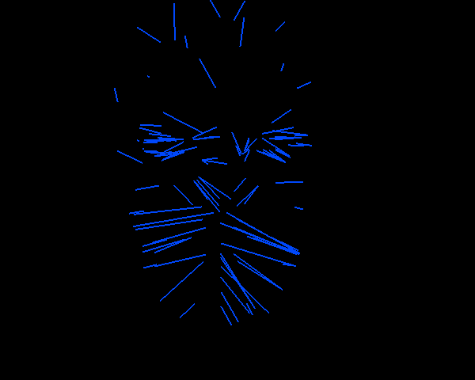

# Procrustes Alignment

This *mini* assignment was completed as part of a course in 3D Digital Geometry (Math 290) taken at Duke University during Spring 2016. The course was taught by [Chris Tralie](http://www.ctralie.com/).

*Procrustes Alignment:

(a) Candide to statue; (b) statue to Candide; (c) Candide to rotated statue (local minima); (d) Candide to Craig*







### Files

*ICPView.py* and ICPViewGLUT.py are two GUI implementations designed for looking at meshes and animating the **iterative closest points algorithm for Procustes Alignment**. The second implemention can be used when wxPython doesn't play nicely on Mac operating systems.

*ICP.py* contains the code written by the student to implement

- Point Correspondences between point clouds
- Procustes Alignment
- and the full iterative closest point algorithm.

### Learning Process

#### Correspondences

The first major conceptual hurdle required figuring out how to exploit NumPy matrix operations, specifically *broadcasting*, in order to do fast arithmetic. In order to find correspondences between points in two point clouds, we can to create a matrix to store the (squared) Euclidean distance from a point in one cloud to each point in the second cloud. We want to do this without `for` loops, because we want this computation to happen very quickly. We can find the indices of correponding points by finding the minimum entry in each row of this pair-wise distance matrix. However, broadcasting

This part of the implementation took me about 5 hours of reading about Python (from scratch), reading about NumPy, playing with various examples provided by Chris Tralie, and debugging in iPython to complete the [*NearestNeighborBrute.py*](https://github.com/COMPSCI290-S2016/NumpyDemos/blob/master/NearestNeighborBrute.py) example.

*from ICP.py*
```python
ab = np.dot(X.transpose(), Y) # each entry is Xi dot Yj
xx = np.sum(X*X, axis=0) # sum along squared coordinates, since points are column vectors
yy = np.sum(Y*Y, axis=0)
D = (xx[:, np.newaxis] + yy[np.newaxis, :]) - 2*ab
idx = np.argmin(D, axis=1)
```

This code snippet fills in the MxN matrix D by:
- using **matrix multiplication** to build the pair-wise dot products for each point from X with each point from Y.
- **broadcasting** dot products of a *point from X with itself* and a *point from Y with itself* 
- **summing** together three matrices: two produced by broadcasting, and one produced by matrix multiplication (and scaled by a constant)

*Correspondences update on each iteration until possible convergence*


#### Procrustes Alignment

Following the lecture slides, I was able to use NumPy to perform a singular value decomposition on the matrix resulting from multiplying Y (3 x M target point cloud, with *corresponding points*) by the transpose of X (3 x M point cloud to be translated and rotated). The rotation matrix was found by multiplying the "left" rotation matrix *U* of USV<sup>*</sup> by the transpose of *V*. This took 30 seconds to write and 1 hour to fix after observing weird fitting behavior due to having swapped the role of X and Y.

#### Iterative Closest Points

The above two implementations are all that is needed to perform iterative closest points.

The loop:

1. Find correspondences with current centroids of the X and Y point clouds, along with the rotation of X
2. Find a new alignment
3. Check if the centroid for X has not changed: if it has not, we are done; otherwise, repeat until we perform MAX_ITERATIONS

### Observations

#### Asymetry in Iterative Closest Points


### Notes
