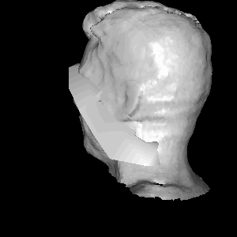

# Procrustes Alignment

Please see this README rendered by GitHub at https://github.com/bmershon/procrustes

*All images, words, and code contained in this repository may be reproduced so long as the original author is given credit (Chris Tralie and Brooks Mershon).*

This *mini* assignment was completed as part of a course in 3D Digital Geometry (Math 290) taken at Duke University during Spring 2016. The course was taught by [Chris Tralie](http://www.ctralie.com/).

*Procrustes Alignment:*

*(a) Candide to statue; (b) statue to Candide; (c) local minimum; (d) Candide to Styrofoam Head*





### Files

*ICPView.py* and ICPViewGLUT.py are two GUI implementations designed for looking at meshes and animating the **iterative closest points algorithm for Procustes Alignment**. The second implemention can be used when wxPython doesn't play nicely on Mac operating systems.

*ICP.py* contains the code written by the student to implement

- Point Correspondences between point clouds
- Procustes Alignment
- and the full iterative closest point algorithm.

### Learning Process

#### Correspondences

The first major conceptual hurdle required figuring out how to exploit NumPy matrix operations, specifically *broadcasting*, in order to do fast arithmetic. In order to find correspondences between points in two point clouds, we can to create a matrix to store the (squared) Euclidean distance from a point in one cloud to each point in the second cloud. We want to do this without `for` loops, because we want this computation to happen very quickly. We can find the indices of correponding points by finding the minimum entry in each row of this pair-wise distance matrix. However, broadcasting

This part of the implementation took me about 5 hours of reading about Python (from scratch), reading about NumPy, playing with various examples provided by Chris Tralie, and debugging in iPython to complete the [*NearestNeighborBrute.py*](https://github.com/COMPSCI290-S2016/NumpyDemos/blob/master/NearestNeighborBrute.py) example.

*from ICP.py*
```python
ab = np.dot(X.transpose(), Y) # each entry is Xi dot Yj
xx = np.sum(X*X, axis=0) # sum along squared coordinates, since points are column vectors
yy = np.sum(Y*Y, axis=0)
D = (xx[:, np.newaxis] + yy[np.newaxis, :]) - 2*ab
idx = np.argmin(D, axis=1)
```

This code snippet fills in the MxN matrix D by:
- using **matrix multiplication** to build the pair-wise dot products for each point from X with each point from Y.
- **broadcasting** dot products of a *point from X with itself* and a *point from Y with itself* 
- **summing** together three matrices: two produced by broadcasting, and one produced by matrix multiplication (and scaled by a constant)

#### Procrustes Alignment

Following the lecture slides, I was able to use NumPy to perform a singular value decomposition on the matrix resulting from multiplying Y (3 x M target point cloud, with *corresponding points*) by the transpose of X (3 x M point cloud to be translated and rotated). The rotation matrix was found by multiplying the "left" rotation matrix *U* of USV<sup>*</sup> by the transpose of *V*. This took 30 seconds to write and 1 hour to fix after observing weird fitting behavior due to having swapped the role of X and Y.

#### Iterative Closest Points

The above two implementations are all that is needed to perform iterative closest points.

The loop:

1. Find correspondences with current centroids of the X and Y point clouds, along with the rotation of X
2. Find a new alignment
3. Check if the centroid for X has not changed (correspondences didn't change): if it has not, we are done; otherwise, repeat until we perform `MAX_ITERATIONS`

### Observations

#### Asymmetry in Iterative Closest Points

We see a great fit when we attempt to fit *Candide.off* to *NotreDameFrontHalf.off*. However, when we try to fit the statue to the low polygon count mesh for *Candide*, we get a rather poor fit. One reason for this is that *Candide.off* is close to a subset of the very front of the face of the statue. The correspondences developed by the implementation create a mapping from each point in X to some point in the target point cloud. It is likely that multiple points in X map to the same point in Y. That right there is not a symmetric relationship! When we try to fit the superset pointcloud to the subset we see that features like the hair and neck which are absent in the subset are able to "pull" the Candide mask away from the close fit we saw when we fit a subset to the superset. *We don't want these superset features to affect the Euclidean distance matrix by producing large distances to features that are not present in the subset point cloud.* There is no way to prevent this from occuring in this simulation. Thus, subset fit to superset works better.

#### Sensitivity to initial rotation

The animations show that local minima can occur when we attempt to fit *Candide.off* to a rotated statue. Where we previously saw a great fit with *Candide* rotated to fit the statue, the perturbation knocked us into a local minimum where the ICP algorithm converged. Why did the ICP algorithm converge? The algorithm stops before the `MAX_ITERATIONS` have occured if the correspondences (and therefore the centroid of Cy) remain unchanged since the last iteration. This can very well occur in a bad position, even if we are fitting a subset point cloud to what is effectively its superset point cloud.

#### Number of iterations

- The *Candide.off* to *NotreDameFrontHalf.off* fit took only 19 iterations to converge.
- The *Candide.off* to the styrofoam head fit took 48 iterations.
- The bad fit of the *Candide* mask to Chris Tralie's head took 84 iterations to arrive at the local minimumm where the mesh lands on his neck.
